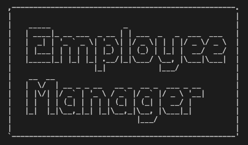

# Employee-Tracker

## Link
Github Repo: https://github.com/SamiF812/Employee-Tracker

Demo Video Link: https://youtu.be/YRiRNYN7NHI

;

## Description
An app run in terminal that allows the user to track their employees. The user would be allowed to add an employee, and set their role, salary, department and manager they report to. The user will also have the ability to view all of this information at any given time by running the application with npm start.

## Usage
Creating and Tracking a companies employees.